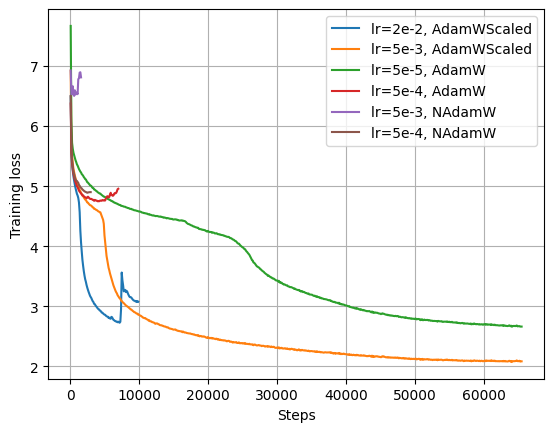

# IndoT5: T5 Language Models for the Indonesian Language!

<div align="center">

[](https://huggingface.co/collections/LazarusNLP/indonesian-t5-language-models-65c1b9a0f6342b3eb3d6d450)

</div>

This project focuses on pre-training a [T5](https://arxiv.org/abs/1910.10683) (Text-to-Text Transfer Transformer) model specifically for the Indonesian language, using [nanoT5](https://github.com/PiotrNawrot/nanoT5) as its training framework. Our aim is to provide fully open-source, budget-constrained, sequence-to-sequence language models for Indonesia that are on-par with state-of-the-art models!

<p align="center">
    
</p>

## Pre-trained Models

| Model                                                                           | #params | Dataset                                                          |
| ------------------------------------------------------------------------------- | :-----: | ---------------------------------------------------------------- |
| [LazarusNLP/IndoNanoT5-base](https://huggingface.co/LazarusNLP/IndoNanoT5-base) |  248M   | [uonlp/CulturaX](https://huggingface.co/datasets/uonlp/CulturaX) |

## Results

We evaluate our models on [IndoNLG](https://github.com/IndoNLP/indonlg), which consists of multiple downsteam generation tasks in Indonesian. The dataset also supports Javanese and Sundanese, but as our model is currently monolingual, we fine-tune on Indonesian tasks only.

> $^\dagger$ IndoNLG baseline results are obtained from the [official IndoNLG paper](https://aclanthology.org/2021.emnlp-main.699/).

### IndoSum

| Model                                                                           | #params |    R1     |    R2     |    RL     |
| ------------------------------------------------------------------------------- | :-----: | :-------: | :-------: | :-------: |
| Scratch $^\dagger$                                                                         |  132M   |   70.52   |   65.43   |   68.35   |
| mBART Large $^\dagger$                                                                    |  610M   |   74.65   |   70.43   |   72.54   |
| mT5 Small $^\dagger$                                                                       |  300M   |   74.04   |   69.64   |   71.89   |
| IndoBART $^\dagger$                                                                        |  132M   |   70.67   |   65.59   |   68.18   |
| IndoGPT $^\dagger$                                                                         |  117M   |   74.49   |   70.34   |   72.46   |
| *Our work*                                                                      |
| [LazarusNLP/IndoNanoT5-base](https://huggingface.co/LazarusNLP/IndoNanoT5-base) |  248M   | **75.29** | **71.23** | **73.30** |

<!-- TODO: Liputan6 -->

<!-- TODO: TyDiQA -->

<!-- TODO: XPersona -->

## Installation

```sh
git clone https://github.com/LazarusNLP/IndoT5.git
cd IndoT5
pip install -r requirements.txt
pip install -r nanoT5/requirements.txt
```

## Dataset

We leverage the existing [uonlp/CulturaX](https://huggingface.co/datasets/uonlp/CulturaX) dataset which contains 23M Indonesian documents, collected and cleaned from the [OSCAR](https://oscar-corpus.com/) corpora and [mc4](https://huggingface.co/datasets/mc4). We selected this dataset as it is sufficiently large and has been deduplicated. More details can be found in their dataset card.

Since this dataset is rather large, we utilize the dataset streaming feature of Hugging Face datasets, which is thankfully also supported in nanoT5. This feature is likewise usable during tokenizer training.

## Train SentencePiece Tokenizer

We first need to train a SentencePiece tokenizer on our pre-pretraining corpus. We followed the uncased T5 tokenizer training implementation from [HuggingFace](https://github.com/huggingface/transformers/tree/main/examples/flax/language-modeling#train-tokenizer-2). We then initialize a T5 config based on [google/t5-v1_1-base](https://huggingface.co/google/t5-v1_1-base) and the newly trained tokenizer. Both the tokenizer and the config are then saved for loading later. 

To train the SentencePiece tokenizer, run `train_tokenizer.py` with the desired arguments:

```sh
python train_tokenizer.py \
    --vocab-size 32000 \
    --dataset-name uonlp/CulturaX \
    --dataset-config id \
    --output-dir outputs/indonesian-t5-base/ \
    --base-model-config google/t5-v1_1-base \
    --hf-repo-id LazarusNLP/IndoNanoT5-base
```

It took us about an hour to train the tokenizer.

## Pre-train T5

NanoT5 handles most of the training process and exposes a clean API to pre-train a T5 model from scratch. We follow their default training configuration, with the exception of a lower learning rate which is specific to our dataset. Other than that, running pre-training is as simple as:

```sh
python -m nanoT5.main \
    optim.name=adamwscale \
    optim.lr_scheduler=cosine \
    optim.base_lr=5e-3 \
    model.name=LazarusNLP/IndoNanoT5-base \
    model.compile=true \
    data.num_workers=16
```

We achieved a negative log-likelihood loss of 2.082 and an accuracy of 57.4% on a heldout subset (1%) of the pre-training corpus.

### Experiments

We experimented with different learning rates, optimizers, and layer initialization strategies. Whilst we found that the default scaled AdamW optimizer worked best for our baseline results, we aim to further improve the results. Specifically, we aim to experiment with:

- [x] Initializing `lm_head` weights with `std=1/sqrt(d_model)`
- [ ] (Unscaled) AdamW Optimizer
- [ ] [NAdamW Optimizer](https://pytorch.org/docs/2.2/generated/torch.optim.NAdam.html#torch.optim.NAdam)
- [ ] [Shampoo](https://arxiv.org/abs/1802.09568) and [CASPR](https://openreview.net/forum?id=8j9hz8DVi8) Optimizers

This growing list of ideas stem from a fruitful discussion [here](https://github.com/PiotrNawrot/nanoT5/issues/25).

<details>
  <summary>Training Losses</summary>
  
  
</details>

<!-- TODO: ## Fine-tune T5 -->

## Acknowledgements

Thanks to [@PiotrNawrot](https://github.com/PiotrNawrot) and [@Birch-san](https://github.com/Birch-san) for the engaging discussion and ideas.

## References

```bibtex
@article{Nawrot2023nanoT5AP,
  title={nanoT5: A PyTorch Framework for Pre-training and Fine-tuning T5-style Models with Limited Resources},
  author={Piotr Nawrot},
  journal={ArXiv},
  year={2023},
  volume={abs/2309.02373},
}
```

## Credits

IndoT5 is developed with love by:

<div style="display: flex;">
<a href="https://github.com/anantoj">
    
</a>

<a href="https://github.com/DavidSamuell">
    
</a>

<a href="https://github.com/stevenlimcorn">
    
</a>

<a href="https://github.com/w11wo">
    
</a>
</div>